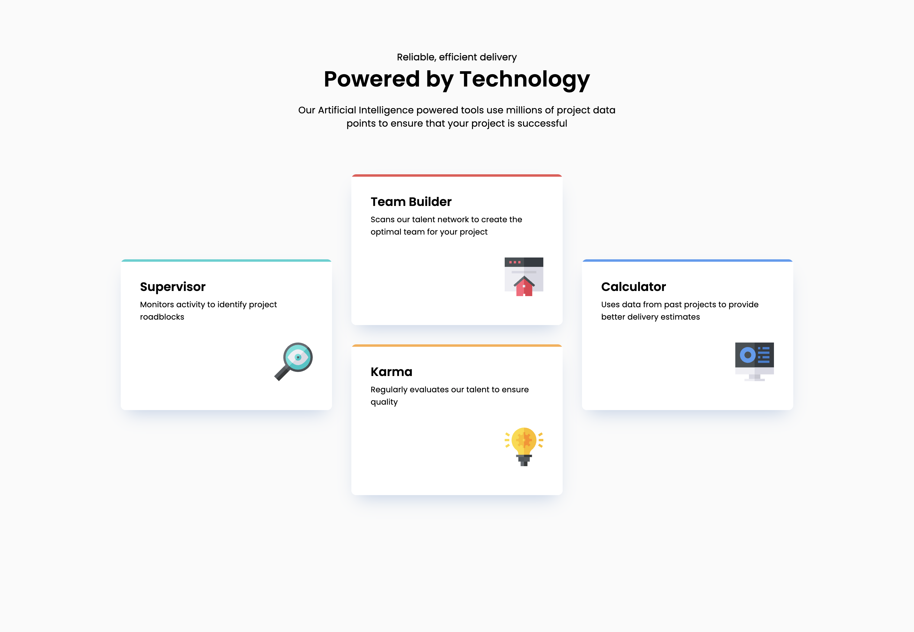

# Frontend Mentor - Four card feature section solution

This is a solution to the [Four card feature section challenge on Frontend Mentor](https://www.frontendmentor.io/challenges/four-card-feature-section-weK1eFYK). Frontend Mentor challenges help you improve your coding skills by building realistic projects. 

## Table of contents

- [Overview](#overview)
  - [The challenge](#the-challenge)
  - [Screenshot](#screenshot)
  - [Links](#links)
- [My process](#my-process)
  - [Built with](#built-with)
  - [What I learned](#what-i-learned)
  - [Continued development](#continued-development)

## Overview

### The challenge

Users should be able to:

- View the optimal layout for the site depending on their device's screen size

### Screenshot

### Links

- [Solution URL](https://github.com/kelseyjhayes/Four-Card-Feature-Section)
- [Live Site](https://your-live-site-url.com)

## My process

### Built with

- Semantic HTML5 markup
- CSS custom properties
- Flexbox
- CSS Grid
- Mobile-first workflow

### What I learned

This was a great exercise for putting my knowledge of CSS Grids to use, and using Grids in combination with Flexbox to acheive a desired look. 

I was really focused on creating pleasant designs across screen sizes, including those lower than 375px. I accomplished this by using the clamp function to create responsive padding and box sizes even as screen sizes get narrower. 

### Continued development

I would like to continue improving my knowledge of CSS Grids, so I can create more complex layouts. I would also like to learn how to make the transitions between grid layouts smoother across screen sizes. 